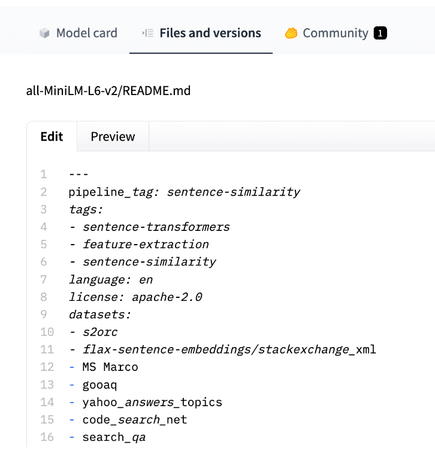
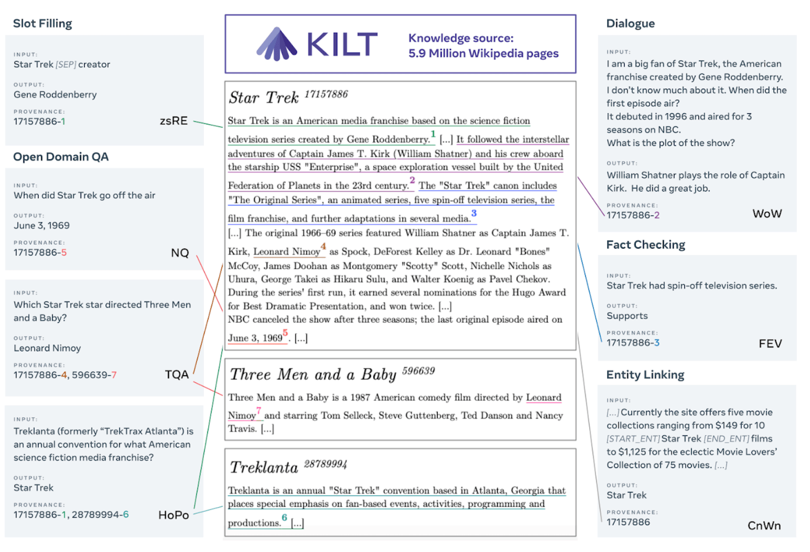

[Weaviate]https://weaviate.io/developers/weaviate/current/) has recently unveiled a new module which allows users to easily [integrate models from Hugging Face](/blog/2022/09/Hugging-Face-Inference-API-in-Weaviate.html) to vectorize their data and incoming queries. [Over 700 models](https://huggingface.co/models?pipeline_tag=sentence-similarity&sort=downloads) (at the time of writing this) that can be easily plugged into Weaviate. 

You may ask: **Why are there so many models and how do they differ?** 
And more importantly: **How to choose a Sentence Transformer for Semantic Search?**

<!--truncate-->

There are too many models to summarize in one flowchart. So instead, we will describe factors on how to differentiate these models and give you tools to **choose the perfect model for your use case**.

{:width="70%"}

## Differences in Deep Learning models

Not too long ago, Deep Learning models were typically differentiated based on architectural decisions. For example, ResNet differs from DenseNet based on how frequently they implement skip connections between layers. Fast forward to today, the Deep Learning community has fallen in love with attention layers and the transformer network architecture. Transformers mostly differ between encoder, decoder, and encoder-decoder designs. They additionally vary at the level of details such as the number of layers and hidden dimension sizes. However, the consideration of these kinds of details is mostly a thing of the past thanks to the beauty of the Hugging Face transformers library and the success of this particular model architecture. These details can generally be summarized into the “parameter count” metric, of which most sentence transformers contain about 22 million parameters.

These days, neural nets differ from each other more so based on **what** they were trained on with respect to **data** -- as well as some subtleties with **how** they were trained, which we will save for a future article. This article will focus on **4 key dimensions**:

1. [Domain](#domain) 
2. [Task](#task)
3. [Scale](#scale)
4. [Modality](#modality)

## Domain  
**Domain** largely describes the high-level notion of what the dataset is about. This is a common term in Machine Learning research to describe differences in large collections of objects. For example, in Computer Vision one **Domain** could be Paintbrush illustrations, and another **Domain** could be Photorealistic images. Both Paintbrush illustrations and Photorealistic images may have been labeled for the same **Task**, i.e. classify images as cats or dogs. The model trained to classify cats in the Paintbrush illustration will not perform as well as the model trained to classify cats in Photorealistic images, if the final use case is Photorealistic images!

Domain differences are very common in Natural Language Processing (NLP), such as the difference between Legal Contracts, Financial Statements, Biomedical Scientific Papers, Wikipedia, or Reddit Conversations to give a few examples.

### Color-coded details
For every model, Hugging Face displays a list of important **color-coded** details, such as:
* Blue - the **dataset** it was trained on
* Green - the **language** of the dataset
* White or Purple - **additional details** about the model

So, if we look at two Deep Learning models, we can see that [dangvantuan/sentence-camembert-large](https://huggingface.co/dangvantuan/sentence-camembert-large) was trained on **stsb_multi_mt**, which is a **French** dataset. 

While [sentence-transformers/all-MiniLM-L6-v2](https://huggingface.co/sentence-transformers/all-MiniLM-L6-v2) was trained on **several datasets** in **English**.

To put it as bluntly as possible, what makes `dangvantuan/sentence-camembert-large` better at French sentence embeddings than `sentence-transformers/all-MiniLM-L6-v2` is that… it was trained on **French** sentences! There are many examples like this, models trained on **biomedical text**, **legal documents**, or **Spanish** are generally going to perform better when tested on that domain compared to models that haven’t been explicitly trained for the domain.

Note that these tags are a part of Hugging Face’s **model cards**, an impressive effort to continue advancing the organization of Machine Learning models. At the time of this writing, model cards still rely on **manual tagging**. It may be the case that the developer uploading the model hasn’t filled out these details. If you are new to Hugging Face, please consider annotating your uploaded models this way, an example of how to do this is shown below:

{:width="50%"}

### Private models
A large part of the beauty of Weaviate’s integration with Hugging Face is that **anyone** can upload their models to Hugging Face and use them in Weaviate’s vector search engine. For example, I am doing research on COVID-19 literature, so I have fine-tuned a model on CORD-19 title to abstract matching and uploaded it to [CShorten/CORD-19-Title-Abstracts](https://huggingface.co/CShorten/CORD-19-Title-Abstracts-1-more-epoch).

### Domain recap
As a quick recap, **Domain** largely describes the high-level notion of **what** the dataset is about. In addition to Domain, there are many **Tasks** used to produce vector embeddings. Unlike language models, in which most models use the training task of “predict the masked out token”, embedding models are trained in a much broader set of ways. For example, **Duplicate Question Detection** might perform better with a different model than one trained with **Question Answering**.

It is a good rule of thumb to find models that have been trained within the same domain as your use case. Another important consideration for this is the task used to label the data and whether this labeling aligns with the task of interest or not. If we have two models trained on **French Legal Contracts** and we are looking to develop a **Question Answering** system… ideally it would be best if the HuggingFace model has not only been trained on **French Legal Contracts**, but **Question Answering** as well.

## Task
A **Task** is the function for which a model was trained, such as Question Answering or Image Classification. Sentence Transformers and other embedding models such as CLIP solve the **Task** of predicting which data point is **similar to the query** and which data point or data points are **dissimilar to the query**. This is different from GPT and BERT style models that complete the **Task** of predicting a masked out token.

Supervised Learning datasets play a prevalent role in Deep Learning applications, especially for many of the Sentence Transformer models. A dataset labeled for Question Answering is very different from Image Classification, or even Duplicate Question Detection.

### Task Benchmarks
Two excellent benchmarks that collect Supervised Learning tasks to evaluate Sentence Transformers are Knowledge Intensive Language Tasks ([KILT](https://ai.facebook.com/tools/kilt/)) and Benchmarking Information Retrieval ([BEIR](https://arxiv.org/abs/2104.08663)). 

**KILT** uses the same domain for all tasks, Wikipedia. Each task is labeled with a different task: Slot Filling, Question Answering, Dialogue, Fact Checking, or Entity Linking.

**BEIR** tests many different tasks: Fact Checking, Citation Prediction, Duplicate Question Retrieval, Argument Retrieval and more.  BEIR also tests a diverse set of domains such as Wikipedia, Scientific Papers, Quora, Stack Exchange, Internet scrapes, News, Financial Documents, and Tweets. 

### Real human query-based datasets
**[MS MARCO](https://arxiv.org/abs/1611.09268)** is another influential dataset containing real human queries on Microsoft bing’s search engine paired with passages that the human user clicked on in hope of answering their query. As another example, **[Quora Question Pairs](https://arxiv.org/abs/1907.01041)** contains human labels of whether or not two questions are asking the same thing. The Sentence Transformer documentation presents 5 main categories of training data - Semantic Textual Similarity (STS):  Natural Language Inference (NLI), Paraphrase Data, Quora Duplicate Questions (QQP), and MS MARCO.

These datasets can be simplified into 2 categories: (1) **Exact Semantic Match** and (2) **Relational Inference**. I believe the adoption of these categories can simplify the organization of text datasets used in embedding optimization.

**Exact Semantic Match** is designed to encapsulate datasets like STS and Quora Question Pairs, as well as the miscellaneous Mono- and Multilingual Paraphrase datasets. 

**Relational Inference** is intended to capture Natural Language Inference, Fact Verification, Question Answering datasets, click logs like MS MARCO, and the massive pool of weakly supervised datasets extracted from web scraping, such as Reddit conversations and stack exchange discussions.

I believe the core difference between **Exact Semantic Match** and **Relational Inference** is whether the task requires some level of intermediate relational processing. For example, in the Natural Language Inference task, it isn’t enough to say “Bowen likes Ice Cream” is equivalent to “I saw Bowen eating Ice Cream.” The model must learn an intermediate function of entailment. These intermediate functions must be learned for Natural Language Inference, Fact Verification, Question Answering, and so on more so than tasks like aligning English to French translations or detecting Question paraphrases.

### Question Answering vs Fact Verification
These two high-level categories are a good starting place for taxonomizing these datasets. However, there are still noticeable differences within each category. For example, what makes **Question Answering** different from **Fact Verification** for evaluating the quality of a Sentence Transformer? Quite simply, questions have a unique style compared to facts. So while the retrieval task is similar in returning the most suitable answers or evidence, the slight difference in question versus stated fact will have an impact on performance. We advise readers to look for these subtle differences when choosing a Sentence Transformer for your use case.

### Task contruction
Another important idea in **Task** construction – that leads nicely to the next topic of **Scale** – is to discuss Supervised and Self-Supervised Learning. Supervised Learning requires humans to annotate the data, whereas Self-Supervised does not. Self-Supervised lets us take advantage of internet-scale data. However, unlike the autoregressive GPT style algorithm, embedding learning hasn’t converged to a single task within Self-Supervised data.

The most common Self-Supervised **Task** heuristic is to use neighboring passages as positive pairs. This works pretty well since most neighboring passages tend to be semantically related. As shown in the 1B training pairs examples, there are many natural cases of this on the internet as well – such as Reddit post-comment pairs or Stack Exchange question-answer pairs.

### Task recap
So generally when choosing a Sentence Transformer for your use case, we want to find the best alignment between **Domain** and **Task** with one of the many pre-trained models. Another key element to understand when looking at the datasets used in training is the **Scale**. Deep Learning models generally benefit from larger-scale datasets, but this may come at the cost of noisy labeling – especially when the model size is not scaled up with the dataset.

## Scale
In Deep Learning, **scale** typically refers to larger models, but here we are using a scale to describe the size of the dataset. But of course, these factors are entangled with one another. At the time of this writing, we generally would need to scale up the model size to take advantage of a larger dataset. Thus, if we are constrained by budget – a high-quality dataset becomes much more important.

Something I found very interesting while researching the **Scale** of embedding datasets for this article, was the Hugging Face community event to “Train the Best Sentence Embedding Model Ever with 1B Training Pairs” led by Nils Reimers. Of the 1 billion pairs, some of the following sub-datasets stood out to me: Reddit Comments from 2015-2018 with **~730 million pairs**! S2ORC Citation pairs at **~116 million**, WikiAnswers duplicate question pairs at **~77 million**, Stack Exchange pairs at **~25 million**, and some labeled datasets like Quora Question Triplets and Natural Questions at around **~100,000** pairs each. I highly recommend checking out this full list, which can be found [here](https://huggingface.co/sentence-transformers/all-MiniLM-L12-v2).

### The appeal of Weakly-Suppervised or Self-Supervised learning techniques
The list of datasets from the 1B training pairs challenge illustrates the appeal of Weakly Supervised or Self-Supervised Learning techniques. To contrast, Natural Questions is one of the larger Supervised datasets for the Question Answering Task. Natural Questions (NQ) requires humans to derive questions given a Wikipedia context as input. As a result of this slow process, the dataset contains 100,231 question-context-answer tuples… Which is quite impressive, but much smaller than the ~730 million pairs extracted from Reddit without human intervention.

The list of datasets from the 1B training pairs challenge illustrates the appeal of Weakly Supervised or Self-Supervised Learning techniques. To contrast, Natural Questions is one of the larger Supervised datasets for the Question Answering **Task**. Natural Questions (NQ) requires humans to derive questions given a Wikipedia context as input. As a result of this slow process, the dataset contains 100,231 question-context-answer tuples… Which is quite impressive, but much smaller than the ~730 million pairs extracted from Reddit without human intervention.

### Scale vs model fit
Large-scale and **expensive** models can achieve remarkable abilities with datasets like 730 million Reddit conversations. However, if we are constrained to the average ~22 million parameters in Sentence Transformers, and are using **Weaviate** for a general question-answering app, the 100,000 examples in Natural Questions will produce a better model than Reddit conversations **for that particular use case**.

### Scale recap
So with respect to **Scale**, we generally want as much data as possible. But if we are getting the data from noisy sources like internet conversation threads, it’s probably not worth the cost of scaling it up.

## Modality
Modality is one of the most exciting emerging trends in Deep Learning that would be a shame to leave out of this discussion. Models such as DALL-E, which generates unbelievable generated images from text prompts, or CLIP, that searches through massive scales of images with natural language interfaces have captured our imagination about the future of Deep Learning. Readers may be happy to know that [the Sentence Transformer library has support for CLIP models](https://huggingface.co/sentence-transformers/clip-ViT-B-32). 

Deep Learning research has mainly been focused on Text, Image, and Image-Text modality combinations, but this space is **quickly emerging** with successes in Video, Audio, Proteins, Chemicals, and many more. I am particularly captivated by Text-Code multimodal spaces and the opportunities of this modality combination plugged into the features of Weaviate’s Vector Search Engine.

## Conclusion
To recap, the HuggingFace Sentence Transformer checkpoints mostly differ in the **data** they were trained on. Picking the model that best aligns with your use case is a matter of identifying the most similar Domain and Task, while mostly welcoming additional scale in the dataset size. Most applications of the Weaviate Vector Search Engine that involve Sentence Transformers are mostly concerned with **Modalities** of Text, Image, or Image-Text space, but the number of these categories seems likely to explode in the near future.

## What's next
Check out the [Getting Started with Weaviate]https://weaviate.io/developers/weaviate/current/getting-started/quick-start.html) and begin building amazing apps with Weaviate.

You can reach out to us on [Slack](https://join.slack.com/t/weaviate/shared_invite/zt-goaoifjr-o8FuVz9b1HLzhlUfyfddhw) or [Twitter](https://twitter.com/SeMI_tech).

Weaviate is open source, you can see the follow the project on [GitHub](https://github.com/semi-technologies/weaviate). Don't forget to give us a ⭐️ while you are there.