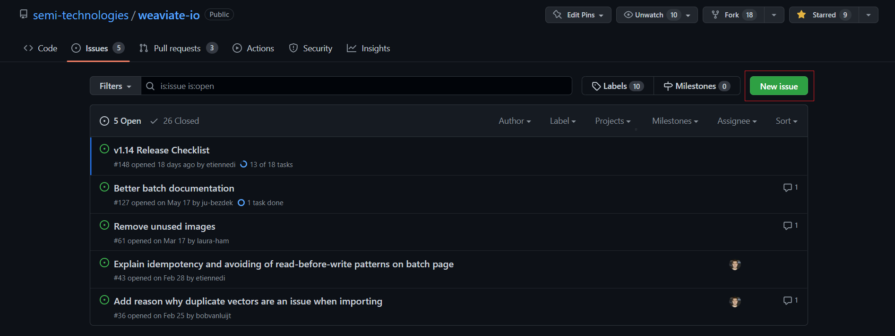

<badges></badges>

## Contributing to Weaviate using git and GitHub

This is a beginner's guide to using git and GitHub to help you contribute to Weaviate. There are four main GitHub repositories of Weaviate, which you can contribute to as beginner. This includes:

* [Weaviate](https://github.com/semi-technologies/weaviate) - our main product Weaviate core
* [Weaviate-io](https://github.com/semi-technologies/weaviate-io) - official Weaviate documentation
* [Weaviate Examples](https://github.com/semi-technologies/weaviate-examples) - apps built using Weaviate vector search engine
* [Awesome Weaviate](https://github.com/semi-technologies/awesome-weaviate) - list of examples and tutorials of how to use the Weaviate vector search engine 

## Installing git 

The most widely used version control system is Git. Git keeps track of the changes you make to files, allowing you to go back to previous versions if necessary and keeping a record of what has been done. Git can be used locally, but in order to preserve your work or collaborate with other team members, you must push your work to a remote repository.

You need to install Git on your computer before you can use it. If it's already installed, updating to the most recent version is probably a good idea. Read more about **installing git** [here](https://git-scm.com/book/en/v2/Getting-Started-Installing-Git).

## Using GitHub

[GitHub](https://github.com/) is a website and cloud-based service that allows developers to store, manage, and track changes to their code. You do not need a GitHub account to use any of the services provided by Weaviate, but you will need one if you want to contribute code or documentation. You will be able to contribute to many of the most popular open source projects with this GitHub account. In fact, it will provide you with a location to keep track of, coordinate, and work on your own projects.

Create a [GitHub account](https://github.com/join) today to begin collaborating and contributing to Open Source projects!

:::note

Be careful not to mix up git and GitHub. Git is a version control tool. GitHub is an online platform that serves as a remote repository for git projects.

:::

You can use git on your local machine, but to save your work or collaborate with other team members, you must push it to a remote repository. In this case, the remote will be GitHub.

Check out [**GitHub Skills**](https://skills.github.com/), a learning program provided by GitHub that will teach you the fundamentals of git and GitHub.

Now that you understand how git and GitHub work, let's get started on contributing to Weaviate!!

## Creating an issue

You can also create an issue first and then work on it. Once you've decided which repository to work on, go to its issue tab and click "New issue."

There are several templates available, such as documentation feedback, bug reporting, and so on. If you want to create your own custom issue, go to the bottom left of the issue list box and click "Open a blank issue."

