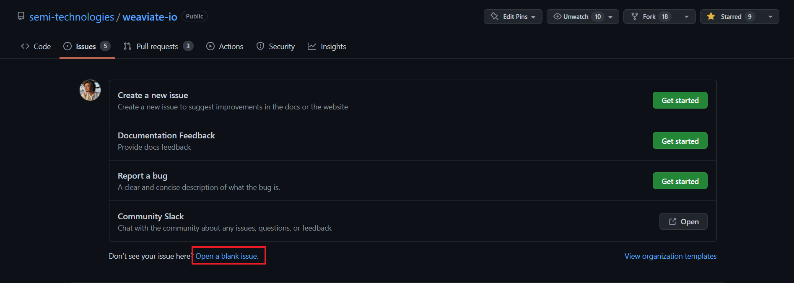
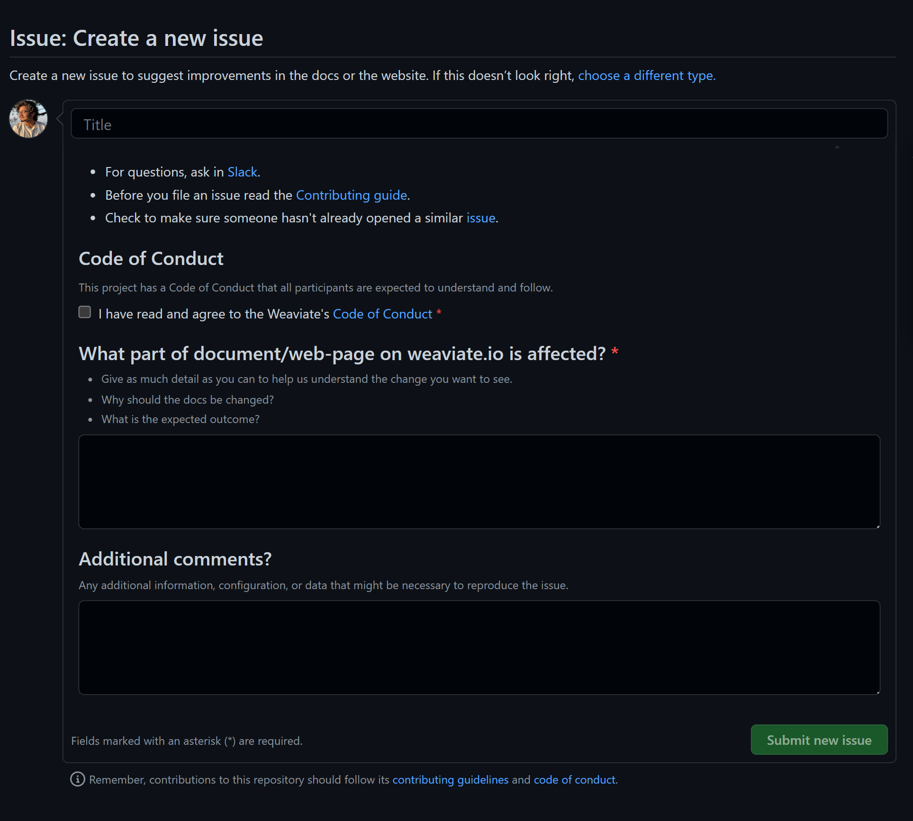
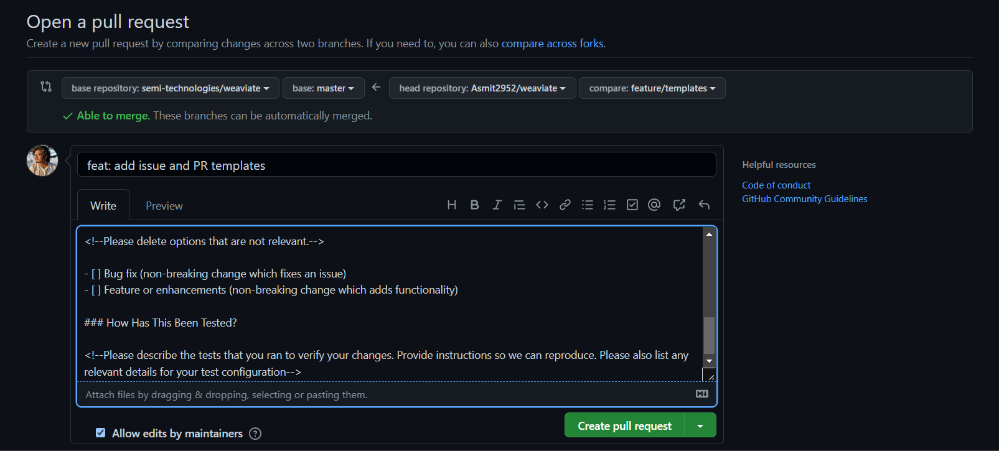

<badges></badges>

## Contributing to Weaviate using git and GitHub

This is a beginner's guide to using git and GitHub to help you contribute to Weaviate. There are four main GitHub repositories of Weaviate, which you can contribute to as beginner. This includes:

* [Weaviate](https://github.com/semi-technologies/weaviate) - our main product Weaviate core
* [Weaviate-io](https://github.com/semi-technologies/weaviate-io) - official Weaviate documentation
* [Weaviate Examples](https://github.com/semi-technologies/weaviate-examples) - apps built using Weaviate vector search engine
* [Awesome Weaviate](https://github.com/semi-technologies/awesome-weaviate) - list of examples and tutorials of how to use the Weaviate vector search engine 

## Installing git 

The most widely used version control system is Git. Git keeps track of the changes you make to files, allowing you to go back to previous versions if necessary and keeping a record of what has been done. Git can be used locally, but in order to preserve your work or collaborate with other team members, you must push your work to a remote repository.

You need to install Git on your computer before you can use it. If it's already installed, updating to the most recent version is probably a good idea. Read more about **installing git** [here](https://git-scm.com/book/en/v2/Getting-Started-Installing-Git).

## Using GitHub

[GitHub](https://github.com/) is a website and cloud-based service that allows developers to store, manage, and track changes to their code. You do not need a GitHub account to use any of the services provided by Weaviate, but you will need one if you want to contribute code or documentation. You will be able to contribute to many of the most popular open source projects with this GitHub account. In fact, it will provide you with a location to keep track of, coordinate, and work on your own projects.

Create a [GitHub account](https://github.com/join) today to begin collaborating and contributing to Open Source projects!

:::note

Be careful not to mix up git and GitHub. Git is a version control tool. GitHub is an online platform that serves as a remote repository for git projects.

:::

You can use git on your local machine, but to save your work or collaborate with other team members, you must push it to a remote repository. In this case, the remote will be GitHub.

Check out [**GitHub Skills**](https://skills.github.com/), a learning program provided by GitHub that will teach you the fundamentals of git and GitHub.

Now that you understand how git and GitHub work, let's get started on contributing to Weaviate!!

## Creating an issue

You can also create an issue first and then work on it. Once you've decided which repository to work on, go to its issue tab and click "New issue."


There are several templates available, such as documentation feedback, bug reporting, and so on. If you want to create your own custom issue, go to the bottom left of the issue list box and click "Open a blank issue."



### Example Issue: Create a new issue



Fill out all of the information correctly. To learn more about what each field means, carefully read the description under each header.

## Forking the repository

* Simply click the `Fork` button on the GitHub website. That's how easy it is. This will create a copy of the repository in your account.


* Once you have done that, head over to your account, select the forked repository, and clone your repo to your local machine


```
git clone git@github.com:<USERNAME>/weaviate.git
```

:::note

("weaviate" is used as the example repo. Make careful to cite the particular repository you are contributing to (for example, "weaviate-io")

:::

* After cloning the repository from GitHub, use the change directory command to navigate to cloned folder

```
cd weaviate
```

* Track the "upstream" repo you forked in order to keep your fork up to date. You'll need to add a remote to complete this

```
git remote add upstream https://github.com/semi-technologies/weaviate.git
```

* To check if your local copy has a reference and upstream link to the remote repository in GitHub, run the command below

```
git remote -v
```

Output:

```
origin    https://github.com/Your_Username/weaviate.git (fetch)
origin    https://github.com/Your_Username/weaviate.git (push)
upstream  https://github.com/semi-technologies/weaviate.git (fetch)
upstream  https://github.com/semi-technologies/weaviate.git (push)
```

When you want to update your fork with the most recent upstream changes, you must first fetch the upstream repo's branches and commits to bring them into your repository. This can be done in two ways:

* [Using GitHub and git CLI](#using-github-and-git-cli)
* [Using git CLI](#using-git-cli)

### Using GitHub and git CLI

* Head over to your forked repository, and under `Fetch Upstream`, click `Fetch and merge`. This will bring all the latest changes in your forked repository.

* Next open git CLI, and checkout on `main` branch (if you make any changes, make sure to commit them first)

```
git checkout main
```

* Then pull the changes into local repository

```
git pull origin main
```

This will sync with the latest changes in your forked repository

### Using git CLI

The only difference between this method and the previous one is that you will fetch the remote using CLI. 

* Check out the `main` branch first

```
git checkout main
```

* Fetch the remote 

```
git fetch upstream
```

* Then pull its changes into your local default branch

```
git pull upstream main
```

* Last, push to your own remote origin to keep the forked repo in sync

```
git push origin main
```

One liner script for super users:

```
git remote add upstream https://github.com/semi-technologies/weaviate.git || true && git fetch upstream && git checkout main && git pull upstream main && git push origin main
```

### View all branches including those from upstream

```
git branch -a
```

## Create a new branch to work on

It's important to create a new branch whenever you start working on a new feature or bugfix. Do not change files when you are on your fork’s master branch. In addition to being standard git process, it also maintains your changes structured and distinct from the `main` branch so that you can submit and handle many pull requests with ease for each task you do.

Create a new branch from the `main` branch to contain your changes. Give your branch its own simple informative name. 

For enhancements use `feature/issue#` or `feature/nameOfFeature`

For bugs use `bug/issue#` or `bug/nameOfBug`

To create a new branch you can use either of these commands

```
git branch feature/newPage      #create a new branch
git checkout feature/newPage    #checkout on created branch
```

Or

```
git checkout -b feature/newPage  
```
**Note:** 
* `checkout` will switch to the newly created branch.
* `-b` will create a new branch if the branch doesn’t already exist

This will create a new branch and checkout to it. Now, start hacking away and making any modifications you want.

## Checking your work

After you've fixed the issue and tested it (Tests are critical! Never submit a change that hasn't been tested), and you should keep track of your progress using this command:

```
git status
```

It will show you which files are currently being modified and which branch you're working on.

## Create a Pull Request

A few considerations must be made before submitting a pull request. Your pull request will be merged more quickly if your branch is cleaned up.

If any commits to the `upstream main branch` have been made during the period you've been working on your changes, you will need to `rebase` your development branch so that merging it will be a fast-forward process without requiring any effort on conflict resolution.

Fetch the upstream main branch and update your local repository by following the [above](#using-git-cli) steps.

Rebase your development branch if there were any new commits

```
git checkout feature/newPage
git rebase main
```

### Pull request process

Here are some general guidelines about how to submit a pull request:

* If you're making visual changes, include a screenshot of the affected element before and after

* Please update the documentation if you change any user-facing functionality in Weaviate

* Each pull request should implement one new feature or fix one bug. Submit multiple pull requests if you want to add or fix multiple items.

* Do not commit changes to files that are irrelevant to your feature or bug fix

* Write a good commit message. Check out [commit guidelines]

**Adding the files and commiting:**

Make sure you are on your development branch

* Add your files to the staging area

```
git add filename
```

You can also use `git add .` to stage all the files, but it is not recommended to use. You might include created files, backups, and configuration files containing information you don't want included. Prior to adding files to the staging area, always validate visually which files need to be staged.

* Check if the file(s) is added in the staging area

```
git status
```

* If everything is good to go, proceed with commiting your changes with a **good commit message**. More information on how to write good commit messages can be found on this [page].

```
git commit -m "your commit message"
```
**Pushing the commit:**

* Now you must commit to the fork. All you have to do is:

```
git push origin feature/newPage
```

It will almost certainly ask for your GitHub login credentials. Enter them, and your commit will be pushed online on the GitHub repository.

When all of your changes have been committed and pushed to GitHub, visit the page for your fork there, choose the development branch, and then press the `Compare & pull request` button. 


If you need to make any further commits to your pull request, simply check out your development branch and push the updates to GitHub. Your pull request will automatically keep track of and update the commits made to your development branch.

* Complete the pull request by filling out our [pull request template](https://github.com/semi-technologies/weaviate/blob/master/.github/PULL_REQUEST_TEMPLATE.md)



* Once your changes are ready, make sure you [self review](#self-reviewing-pull-requests) your pull request to speed up the review process.

## Self reviewing pull requests

You should always review your own pull request first.

For any changes you commit, make sure that you:

* Confirm that the changes meet the objectives of the issue you created or are working on.

* Compare your pull request's source changes to staging to ensure that the output matches the source and that everything is rendering as expected. This assists in detecting issues such as typos or content that isn't rendering due to versioning issues.

* Check for technical accuracy in the content. You can always [ask for help](https://weaviate.slack.com/) if you get stuck.

* Verify that the syntax of new or updated Liquid statements is proper. Jekyll uses the [Liquid](https://shopify.github.io/liquid/) templating language to process templates.

* If there are any failing checks in your PR, try troubleshooting them until they are passing or [ask for help](https://weaviate.slack.com/).

## What after submitting pull request?

After you've created the Pull Request, there are two possibilities:

* Your PR will be accepted, and your commit will be merged into the master branch, congratulations!

* Your PR will be rejected/put on hold. There are two possibilities when a PR is rejected:
  * Irrelevant or breaking changes
  * Reviewer wants something changed