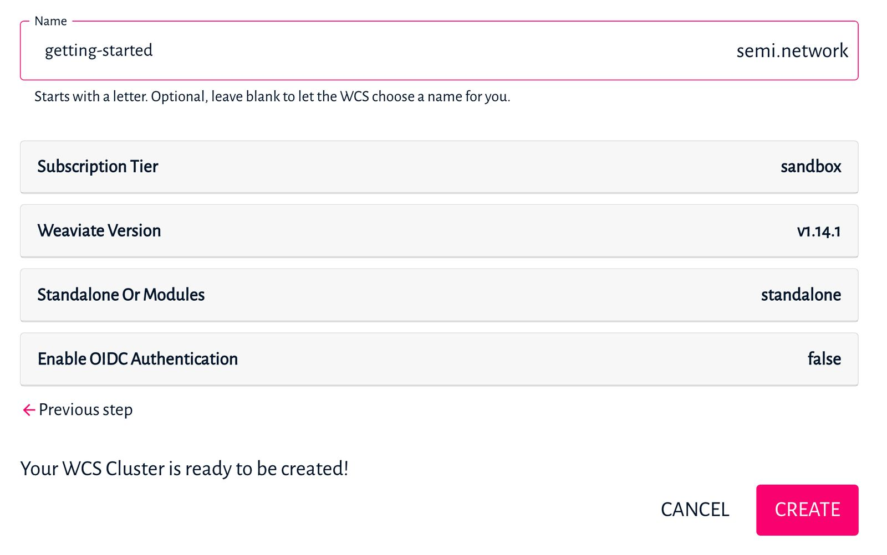

<badges></badges>

There are three ways you can run Weaviate, and they are -we believe- pretty straightforward.

* [**Weaviate Cloud Service**](#weaviate-cloud-service)
* [**Docker**](#docker)
* [**Kubernetes**](#kubernetes)

## Weaviate Cloud Service

The fastest way 🚀 to create a new Weaviate instance – from scratch – is to use the Weaviate Cloud Service (aka, the WCS). The WCS is a completely managed service, so you don’t have to install or maintain anything to run Weaviate. Currently, the service is in private beta, but (🤫) if you log in to the [Weaviate Cloud Console](https://console.semi.technology/), you can create a free sandbox to play around with.

If you are itching to get started with WCS, just skip to the [WCS hands-on section](#wcs-hands-on).

## Running Weaviate yourself

Alternatively, if you prefer to install and deploy Weaviate yourself, then you can work with either Docker or Kubernetes.

### Docker

Working with Docker is great if you are building an application around Weaviate and want to run Weaviate on your local machine or in the cloud. If you have Docker already installed, you could have it all up and running in seconds (minutes if you use a prepackaged transformers module).

We even have a handy [step-by-step configurator](https://weaviate.io/developers/weaviate/current/installation/docker-compose.html#configurator), which let’s you pick you configuration, and as a result you will receive a command to spin up your docker setup.

You can find the installation instructions for Kubernetes [here](https://weaviate.io/developers/weaviate/current/installation/docker-compose.html#configurator).

### Kubernetes

Generally, we recommend using Kubernetes to deploy Weaviate for any long-running deployments or those with specific availability expectations, such as production use cases.

For local development or personal evaluation, using Docker Compose will most likely be sufficient.

### Self-deployment instructions

The installation and configuration with Docker and Kubernetes is out of scope for this tutorial. If you prefer to deploy Weaviate yourself, see the [installation documentation](https://weaviate.io/developers/weaviate/current/installation/) page. 

If you feel comfortable making a few changes to the code examples in the tutorial and you prefer to run Weaviate locally. You can set up Weaviate with Docker in two steps:

1. Get `docker-compose.yml` configuration file by calling:

``` 
curl -o docker-compose.yml "https://configuration.semi.technology/v2/docker-compose/docker-compose.yml?enterprise_usage_collector=false&modules=standalone&runtime=docker-compose&weaviate_version=v15.0.0"
```

2. Sping up docker

```
 docker-compose up -d
```

Then you can continue with the tutorial with at Schema page.

## WCS hands-on

To create a new Weaviate instance on the Weaviate Cloud Service, we need to follow these steps:

* [**Sign in to WCS**](#sign-in-to-wcs)
* [**Create a Weaviate Cluster**](#create-a-weaviate-cluster)
* [**Test the connection**](#test-the-connection)

### Sign in to WCS

In order to access WCS, navigate to the [Weaviate Cloud Console](https://console.semi.technology/) and “Sign in with the Weaviate Cloud Service”, where you will be able to create and manage your Weaviate Clusters.

No account, no problem

If you don’t have an account with WCS yet, click the [“Don’t have an account? Sign Up”](https://auth.wcs.api.semi.technology/auth/realms/SeMI/protocol/openid-connect/registrations?client_id=wcs&response_type=code&redirect_uri=https://console.semi.technology/console/wcs) link and create an account.


### Create a Weaviate Cluster

To create a new Weaviate Cluster:

* Press the `Create a Weaviate Cluster` button
* Configure the cluster:
    * Set the `name` for your cluster – note: The name will become part of the URL we will use to access this instance. Please use a different name than “getting-started”.
    * Leave the `Subscription Tier` as `Sandbox` - note: The sandbox is free, but it will expire after 5 days
    * Leave the `Weaviate Version` as the latest
    * Leave the `Standalone Or Modules` as `Standalone, no Modules`
    * **Change** the `OIDC Authentication` to `Disabled`



* Finally, press **Create**.

This will start the process to create a new cluster. The status indicator on the left will show the progress (in %); after a few minutes, you should see a green tick ✔️ - indicating that the cluster is ready.

### Test the connection

To test the connection, click on the Cluster Id link, which will open a new page in your browser and display all the available endpoints.


:::note

For every endpoint, there is a documentationHref link, which points us to relevant documentation pages.

:::

Now, we are ready to start working with Weaviate. 🎉

## Recapitulation

* You can run Weaviate with Weaviate Cloud Service, Docker or Kubernetes.

* Weaviate Cloud Service is a managed Weaviate SaaS - great for development and production.

* Docker alows you to set up Weaviate on your machine or in the cloud – great for development and production.

* Kubernetes is great for long-running Weaviate deployments.

* You have a working instance of Weaviate in WCS.

## Next Steps
Next, learn about the [Weaviate Schema].

Alternatively, you can:

* [Skip to Querying in Weaviate]
* [Go back to the basics](https://weaviate.io/developers/weaviate/current/core-knowledge/basics.html)